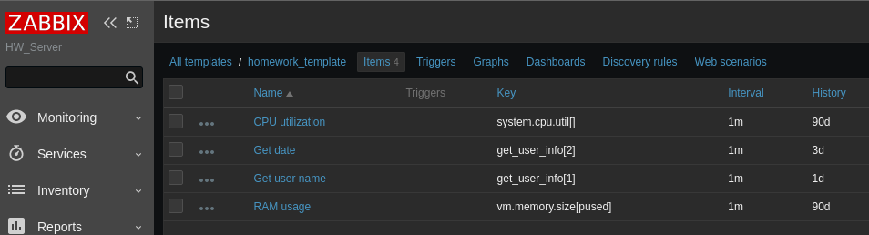
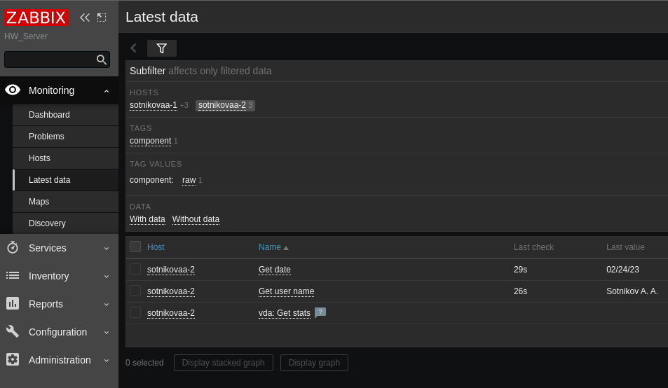
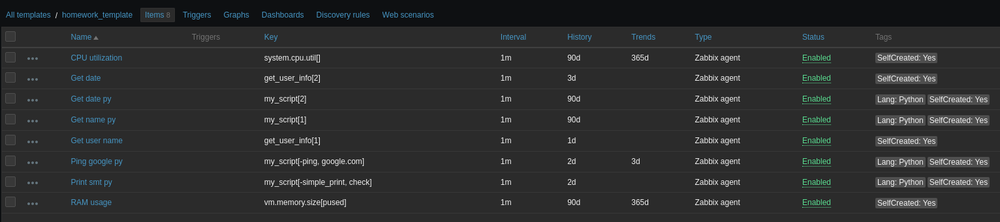
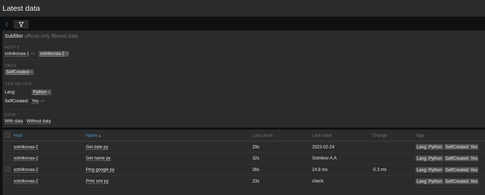
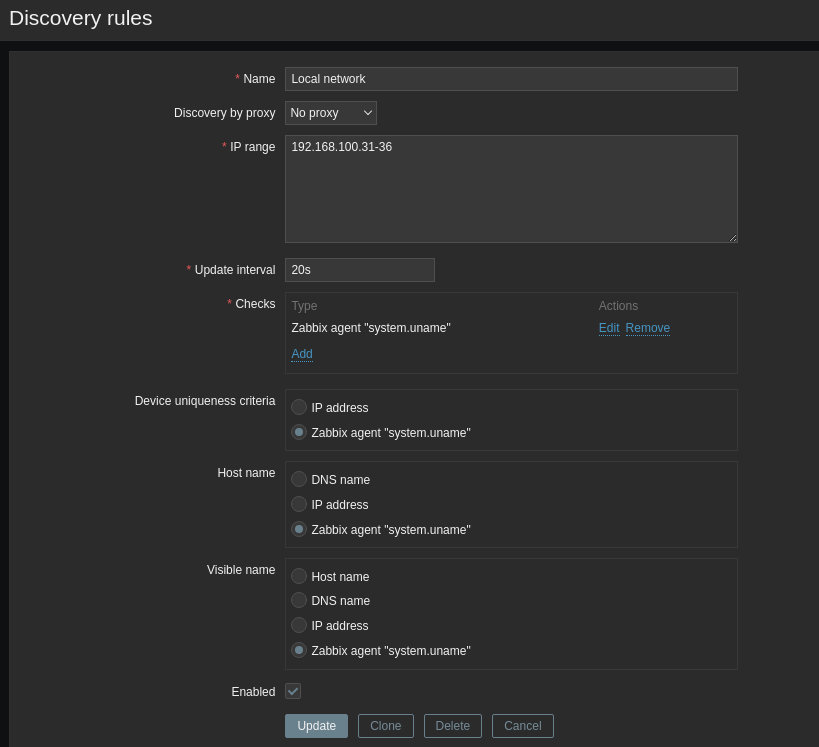
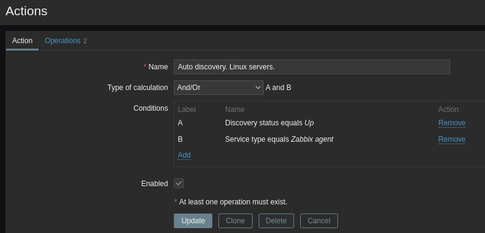
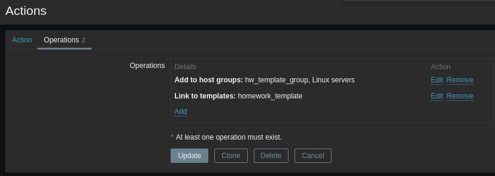
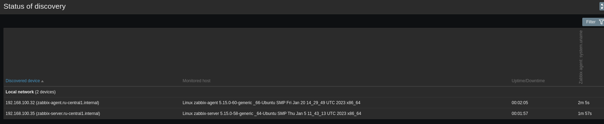

# Домашнее задание к занятию "`Название занятия`" - `Андрей Сотников`

### Задание 1

> Создайте свой шаблон, в котором будут элементы данных, мониторящие загрузку CPU и RAM хоста.
>
> *Сохраните в Git скриншот страницы шаблона с названием «Задание 1».*


---

### Задание 2

> Добавьте в Zabbix два хоста и задайте им имена <фамилия и инициалы-1> и <фамилия и инициалы-2>. Например: ivanovii-1 и ivanovii-2.
>
> *Результат этого задания сдавайте вместе с заданием 3.*

---

### Задание 3

> Привяжите созданный шаблон к двум хостам. Также привяжите к обоим хостам шаблон Linux by Zabbix Agent.
>
> *Сохраните в Git скриншот страницы хостов, где будут видны привязки шаблонов с названиями «Задание 2-3». Хосты должны иметь зелёный статус подключения.*


---

### Задание 4

> Создайте свой кастомный дашборд.
>
> *Сохраните в Git скриншот дашборда с названием «Задание 4».*


---

### Задание 5*

> Создайте карту и расположите на ней два своих хоста:
>
> 1. Настройте между хостами линк.
> 2. Привяжите к линку триггер, связанный с agent.ping одного из хостов, и установите индикатором сработавшего триггера красную пунктирную линию.
> 3. Выключите хост, чей триггер добавлен в линк. Дождитесь срабатывания триггера.
>
> * Сохраните в Git скриншот карты, где видно, что триггер сработал, с названием «Задание 5».*


---

## Задание 6* со звёздочкой

> Создайте UserParameter на bash и прикрепите его к созданному вами ранее шаблону. Он должен вызывать скрипт, который:
>
> * при получении 1 будет возвращать ваши ФИО,
> * при получении 2 будет возвращать текущую дату.
>
> *Приложите в Git код скрипта, а также скриншот Latest data с результатом работы скрипта на bash, чтобы был виден результат работы скрипта при отправке в него 1 и 2.*

``` bash
#! /bin/bash

case "$1" in
    1 ) echo "Sotnikov A. A.";;
    2 ) date +%D;;
    * ) echo "Nothing to show";;
esac

```

  



 ---

### Задание 7* со звёздочкой

> Доработайте Python-скрипт из лекции, создайте для него UserParameter и прикрепите его к созданному вами ранее шаблону.
> Скрипт должен:
>
> * при получении 1 возвращать ваши ФИО,
> * при получении 2 возвращать текущую дату,
> * делать всё, что делал скрипт из лекции.
>
> *Приложите код скрипта в Git. Приложите в Git скриншот Latest data с результатом работы скрипта на Python, чтобы были видны результаты работы скрипта при отправке в него 1, 2, -ping, а также -simple_print.*

``` python

import sys
import os
import re
from datetime import date

if (sys.argv[1] == '-ping'): # Если -ping
    result=os.popen("ping -c 1 " + sys.argv[2]).read() # Делаем пинг по заданному адресу
    result=re.findall(r"time=(.*) ms", result) # Выдёргиваем из результата время
    print(result[0]) # Выводим результат в консоль
elif (sys.argv[1] == '-simple_print'): # Если simple_print
    print(sys.argv[2]) # Выводим в консоль содержимое sys.arvg[2]
elif (sys.argv[1] == '1'):
    print("Sotnikov A.A")
elif (sys.argv[1] == '2'):
    print(date.today())
else: # Во всех остальных случаях
    print(f"unknown input: {sys.argv[1]}") #Выводим непонятый запрос в консоль
```





 ---

### Задание 8* со звёздочкой

> Настройте автообнаружение и прикрепление к хостам созданного вами ранее шаблона.
>
> *Приложите в Git скриншот правила обнаружения. Приложите в Git скриншот страницы Discover, где видны оба хоста.*









 ---

### Задание 9* со звёздочкой

> Доработайте скрипты Vagrant для 2-х агентов, чтобы они были готовы к автообнаружению сервером, а также имели на борту разработанные вами ранее параметры пользователей.
>
> *Приложите в Git файлы Vagrantfile и zabbix-agent.sh.*

[Сделано через ansible (первая play)](ansible/playbook.yaml)
